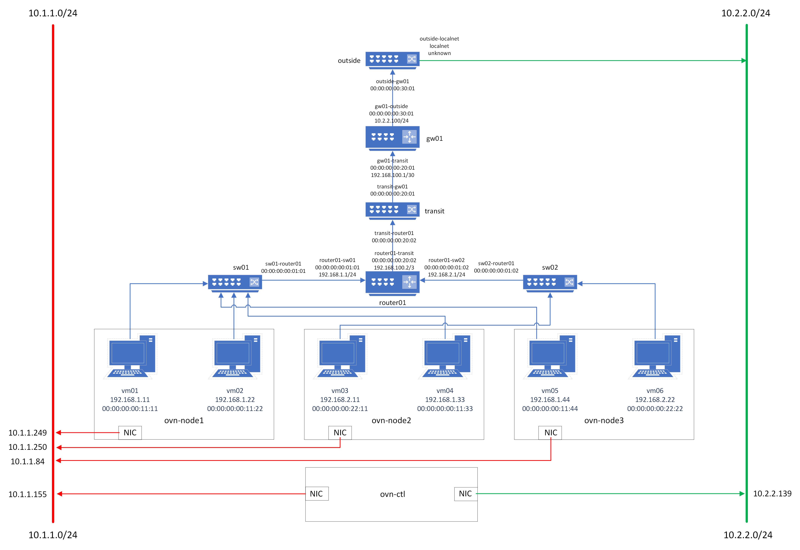

# OVN Lab

FULL diagram



## Setup OVN

Lab setup 4 nodes

```bash
ovn-ctl 10.1.1.155
ovn-node1 10.1.1.249
ovn-node2 10.1.1.250
ovn-node3 10.1.1.84
```

```bash
echo '10.1.1.155 ovn-ctl' >> /etc/hosts
echo '10.1.1.249 ovn-node1' >> /etc/hosts
echo '10.1.1.250 ovn-node2' >> /etc/hosts
echo '10.1.1.84 ovn-node3' >> /etc/hosts
```

Run on each node

```bash
apt update && apt upgrade -y
```

On node **ovn-ctl**:
```bash
apt install ovn-central -y
```

Edit the file **/etc/default/ovn-central**
```bash
OVN_CTL_OPTS=" \
     --db-nb-addr=10.1.1.155 \
     --db-sb-addr=10.1.1.155 \
     --db-nb-create-insecure-remote=yes \
     --db-sb-create-insecure-remote=yes \
     --db-nb-cluster-local-addr=10.1.1.155 \
     --db-sb-cluster-local-addr=10.1.1.155 \
     --ovn-northd-nb-db=tcp:10.1.1.155:6641 \
     --ovn-northd-sb-db=tcp:10.1.1.155:6642"
```

And restart the service
```bash
systemctl restart ovn-central
```

Check that remote ports are open

```bash
root@ovn-ctl ~# netstat -tplun 
Active Internet connections (only servers)
Proto Recv-Q Send-Q Local Address           Foreign Address         State       PID/Program name
tcp        0      0 10.1.1.155:6644         0.0.0.0:*               LISTEN      5034/ovsdb-server
tcp        0      0 10.1.1.155:6642         0.0.0.0:*               LISTEN      5034/ovsdb-server
tcp        0      0 10.1.1.155:6643         0.0.0.0:*               LISTEN      5043/ovsdb-server
tcp        0      0 10.1.1.155:6641         0.0.0.0:*               LISTEN      5043/ovsdb-server 
```

On node **ovn-node1** to **ovn-node3**
```bash
apt install ovn-host -y
```

Run:
```bash
ovs-vsctl set open_vswitch . \
    external_ids:ovn-remote=tcp:10.1.1.155:6642 \
    external_ids:ovn-encap-type=geneve \
    external_ids:ovn-encap-ip=<local_ip>
```

Check on **ovn-ctl**
```bash
root@ovn-ctl ~# ovn-sbctl show
Chassis "d589645d-9353-43ef-b10b-94c4aa94be1d"
    hostname: ovn-node1
    Encap geneve
        ip: "10.1.1.249"
        options: {csum="true"}
Chassis "e88838e8-f48f-4c25-a28c-227e8e0d0395"
    hostname: ovn-node2
    Encap geneve
        ip: "10.1.1.250"
        options: {csum="true"}
Chassis "1bf1fac9-44b9-4360-aebb-2595c791fd68"
    hostname: ovn-node3
    Encap geneve
        ip: "10.1.1.84"
        options: {csum="true"}
```

Check on **ovn-nodes**
```bash
root@ovn-node2 ~# ovs-vsctl show
ed6fd25e-9418-48b7-b379-111ad9ba3608
    Bridge br-int
        fail_mode: secure
        datapath_type: system
        Port br-int
            Interface br-int
                type: internal
        Port ovn-1bf1fa-0
            Interface ovn-1bf1fa-0
                type: geneve
                options: {csum="true", key=flow, remote_ip="10.1.1.84"}
        Port ovn-d58964-0
            Interface ovn-d58964-0
                type: geneve
                options: {csum="true", key=flow, remote_ip="10.1.1.249"}
    ovs_version: "2.17.9"
```

## Setup skydive

Clone skydive source

```bash
https://github.com/skydive-project/skydive.git && cd skydive/contrib/ansible
```

Edit **inventory/hosts.multiple** per your usage

Fix case when `sh` cannot find executable

```bash
sed -i 's/env python/python/' roles/skydive_common/library/yedit.py
```

Generate symlink for `python`

```bash
ansible -i inventory/hosts.multiple -a "ln -s /usr/bin/python /usr/bin/python3"
```

Deploy skydive

```bash
ansible-playbook -i inventory/hosts.multiple playbook.yml.sample
```

## Create logical switches and routers


- 2 logical switches: `sw01` and `sw02`
- Logical router `router01` connecting the two logical switches
- IP network 192.168.1.0/24 for `sw01`
- IP network 192.168.2.0/24 for `sw02`
- Some `VMs` on each logical switches

Create 2 logical switches

```bash
# Create 2 logical switches

ovn-nbctl ls-add sw01
ovn-nbctl ls-add sw02
```

Create logical router and router ports

```bash
# add the router
ovn-nbctl lr-add router01

# create router port for the connection to sw01
ovn-nbctl lrp-add router01 router01-sw01 00:00:00:00:01:01 192.168.1.1/24

# create the sw01 switch port for connection to router01
ovn-nbctl lsp-add sw01 sw01-router01
ovn-nbctl lsp-set-type sw01-router01 router
ovn-nbctl lsp-set-addresses sw01-router01 00:00:00:00:01:01
ovn-nbctl lsp-set-options sw01-router01 router-port=router01-sw01

# create router port for the connection to sw02
ovn-nbctl lrp-add router01 router01-sw02 00:00:00:00:01:02 192.168.2.1/24

# create the sw02 switch port for connection to router01
ovn-nbctl lsp-add sw02 sw02-router01
ovn-nbctl lsp-set-type sw02-router01 router
ovn-nbctl lsp-set-addresses sw02-router01 00:00:00:00:01:02
ovn-nbctl lsp-set-options sw02-router01 router-port=router01-sw02
```

Check result

```bash
root@ovn-ctl ~# ovn-nbctl show 
switch ebad8d0c-1c9c-422d-8a6c-8dbface8aa9c (sw02)
    port sw02-router01
        type: router
        addresses: ["00:00:00:00:01:02"]
        router-port: router01-sw02
switch e503859a-1d36-4150-952c-af1cd9f6cff6 (sw01)
    port sw01-router01
        type: router
        addresses: ["00:00:00:00:01:01"]
        router-port: router01-sw01
router c2dec343-2514-4b53-9e95-f991da002137(router01)
    port router01-sw01
        mac: "00:00:00:00:01:01"
        networks: ["192.168.1.1/24"]
    port router01-sw02
        mac: "00:00:00:00:01:02"
        networks: ["192.168.2.1/24"]
```

## Adding DHCP

Basic info

```bash
vm01:
  - ovn-node1
  - sw01
  - 00:00:00:00:11:11
  - 192.168.1.11
vm02:
  - ovn-node1
  - sw01
  - 00:00:00:00:11:22
  - 192.168.1.22

vm03:
  - ovn-node2
  - sw02
  - 00:00:00:00:22:11
  - 192.168.2.11
vm04:
  - ovn-node2
  - sw01
  - 00:00:00:00:11:33
  - 192.168.1.33

vm05:
  - ovn-node3
  - sw01
  - 00:00:00:00:11:44
  - 192.168.1.44
vm06:
  - ovn-node3
  - sw02
  - 00:00:00:00:22:22
  - 192.168.2.22
```

```bash
# vm01 sw01 00:00:00:00:11:11 192.168.1.11
ovn-nbctl lsp-add sw01 sw01-vm01
ovn-nbctl lsp-set-addresses sw01-vm01 "00:00:00:00:11:11 192.168.1.11"
ovn-nbctl lsp-set-port-security sw01-vm01 "00:00:00:00:11:11 192.168.1.11"

# vm02 sw01 00:00:00:00:11:22 192.168.1.22
ovn-nbctl lsp-add sw01 sw01-vm02
ovn-nbctl lsp-set-addresses sw01-vm02 "00:00:00:00:11:22 192.168.1.22"
ovn-nbctl lsp-set-port-security sw01-vm02 "00:00:00:00:11:22 192.168.1.22"

# vm03 sw02 00:00:00:00:22:11 192.168.2.11
ovn-nbctl lsp-add sw02 sw02-vm03
ovn-nbctl lsp-set-addresses sw02-vm03 "00:00:00:00:22:11 192.168.2.11"
ovn-nbctl lsp-set-port-security sw02-vm03 "00:00:00:00:22:11 192.168.2.11"

# vm04 sw01 00:00:00:00:11:33 192.168.1.33
ovn-nbctl lsp-add sw01 sw01-vm04
ovn-nbctl lsp-set-addresses sw01-vm04 "00:00:00:00:11:33 192.168.1.33"
ovn-nbctl lsp-set-port-security sw01-vm04 "00:00:00:00:11:33 192.168.1.33"

# vm05 sw01 00:00:00:00:11:44 192.168.1.44
ovn-nbctl lsp-add sw01 sw01-vm05
ovn-nbctl lsp-set-addresses sw01-vm05 "00:00:00:00:11:44 192.168.1.44"
ovn-nbctl lsp-set-port-security sw01-vm05 "00:00:00:00:11:44 192.168.1.44"

# vm06 sw02 00:00:00:00:22:22 192.168.2.22 
ovn-nbctl lsp-add sw02 sw02-vm06
ovn-nbctl lsp-set-addresses sw02-vm06 "00:00:00:00:22:22 192.168.2.22"
ovn-nbctl lsp-set-port-security sw02-vm06 "00:00:00:00:22:22 192.168.2.22"
```

Create OVN dhcp options and assign to logical switch ports

```bash
# sw01
ovn-nbctl create DHCP_Options cidr=192.168.1.0/24 options="\"server_id\"=\"192.168.1.1\" \"server_mac\"=\"00:00:00:00:01:01\" \"lease_time\"=\"3600\" \"router\"=\"192.168.1.1\""

# sw02
ovn-nbctl create DHCP_Options cidr=192.168.2.0/24 options="\"server_id\"=\"192.168.2.1\" \"server_mac\"=\"00:00:00:00:02:01\" \"lease_time\"=\"3600\" \"router\"=\"192.168.2.1\""
```

```bash
root@ovn-ctl ~# nb dhcp-options-list
# sw01
bde0b4ce-b682-4074-a7b3-0c25f390fd64
# sw02
f1e45605-8561-47d0-a3b5-9dfc730ea7ed
```

Assign to ports

```bash
ovn-nbctl lsp-set-dhcpv4-options sw01-vm01 bde0b4ce-b682-4074-a7b3-0c25f390fd64
ovn-nbctl lsp-set-dhcpv4-options sw01-vm02 bde0b4ce-b682-4074-a7b3-0c25f390fd64
ovn-nbctl lsp-set-dhcpv4-options sw01-vm04 bde0b4ce-b682-4074-a7b3-0c25f390fd64
ovn-nbctl lsp-set-dhcpv4-options sw01-vm05 bde0b4ce-b682-4074-a7b3-0c25f390fd64
ovn-nbctl lsp-set-dhcpv4-options sw02-vm03 f1e45605-8561-47d0-a3b5-9dfc730ea7ed
ovn-nbctl lsp-set-dhcpv4-options sw02-vm06 f1e45605-8561-47d0-a3b5-9dfc730ea7ed
```

## Using linux network namespaces

Using linux network namepsace to replicate VMs behavior

### ovn-node1

```bash
# vm01
ip netns add vm01
ovs-vsctl add-port br-int vm01 -- set interface vm01 type=internal
ip link set vm01 address 00:00:00:00:11:11
ip link set vm01 netns vm01
ovs-vsctl set Interface vm01 external_ids:iface-id=sw01-vm01
ip netns exec vm01 dhclient vm01

# vm02
ip netns add vm02
ovs-vsctl add-port br-int vm02 -- set interface vm02 type=internal
ip link set vm02 address 00:00:00:00:11:22
ip link set vm02 netns vm02
ovs-vsctl set Interface vm02 external_ids:iface-id=sw01-vm02
ip netns exec vm02 dhclient vm02
```

### ovn-node2

```bash
# vm01
ip netns add vm03
ovs-vsctl add-port br-int vm03 -- set interface vm03 type=internal
ip link set vm03 address 00:00:00:00:22:11
ip link set vm03 netns vm03
ovs-vsctl set Interface vm03 external_ids:iface-id=sw02-vm03
ip netns exec vm03 dhclient vm03

# vm02
ip netns add vm04
ovs-vsctl add-port br-int vm04 -- set interface vm04 type=internal
ip link set vm04 address 00:00:00:00:11:33
ip link set vm04 netns vm04
ovs-vsctl set Interface vm04 external_ids:iface-id=sw01-vm04
ip netns exec vm04 dhclient vm04
```

### ovn-node3

```bash
# vm05
ip netns add vm05
ovs-vsctl add-port br-int vm05 -- set interface vm05 type=internal
ip link set vm05 address 00:00:00:00:11:44
ip link set vm05 netns vm05
ovs-vsctl set Interface vm05 external_ids:iface-id=sw01-vm05
ip netns exec vm05 dhclient vm05

# vm06
ip netns add vm06
ovs-vsctl add-port br-int vm06 -- set interface vm06 type=internal
ip link set vm06 address 00:00:00:00:22:22
ip link set vm06 netns vm06
ovs-vsctl set Interface vm06 external_ids:iface-id=sw02-vm06
ip netns exec vm06 dhclient vm06
```

### Checking result

- vm01 to gateway

```bash
root@ovn-node1 ~# ip netns exec vm01 ping 192.168.1.1 -c1
PING 192.168.1.1 (192.168.1.1) 56(84) bytes of data.
64 bytes from 192.168.1.1: icmp_seq=1 ttl=254 time=0.724 ms

--- 192.168.1.1 ping statistics ---
1 packets transmitted, 1 received, 0% packet loss, time 0ms
rtt min/avg/max/mdev = 0.724/0.724/0.724/0.000 ms
root@ovn-node1 ~# ip netns exec vm01 ping 192.168.2.1 -c1
PING 192.168.2.1 (192.168.2.1) 56(84) bytes of data.
64 bytes from 192.168.2.1: icmp_seq=1 ttl=254 time=0.680 ms

--- 192.168.2.1 ping statistics ---
1 packets transmitted, 1 received, 0% packet loss, time 0ms
rtt min/avg/max/mdev = 0.680/0.680/0.680/0.000 ms
```

- vm01 to vm02 via the local ovs bridge

```bash
root@ovn-node1 ~# ip netns exec vm01 ping 192.168.1.22 -c3
PING 192.168.1.22 (192.168.1.22) 56(84) bytes of data.
64 bytes from 192.168.1.22: icmp_seq=1 ttl=64 time=0.461 ms
64 bytes from 192.168.1.22: icmp_seq=2 ttl=64 time=0.076 ms
64 bytes from 192.168.1.22: icmp_seq=3 ttl=64 time=0.077 ms

--- 192.168.1.22 ping statistics ---
3 packets transmitted, 3 received, 0% packet loss, time 2056ms
rtt min/avg/max/mdev = 0.076/0.204/0.461/0.181 ms 
```

- vm01 to vm04 through the overlay

```bash
root@ovn-node1 ~# ip netns exec vm01 ping 192.168.1.33 -c3
PING 192.168.1.33 (192.168.1.33) 56(84) bytes of data.
64 bytes from 192.168.1.33: icmp_seq=1 ttl=64 time=4.49 ms
64 bytes from 192.168.1.33: icmp_seq=2 ttl=64 time=1.33 ms
64 bytes from 192.168.1.33: icmp_seq=3 ttl=64 time=1.40 ms

--- 192.168.1.33 ping statistics ---                      
3 packets transmitted, 3 received, 0% packet loss, time 2004ms
rtt min/avg/max/mdev = 1.332/2.407/4.488/1.471 ms
```

- vm03 to vm04 through the router, via the local ovs bridge

```bash
root@ovn-node2 ~# ip netns exec vm03 ping 192.168.1.33 -c3
PING 192.168.1.33 (192.168.1.33) 56(84) bytes of data.
64 bytes from 192.168.1.33: icmp_seq=1 ttl=63 time=1.60 ms
64 bytes from 192.168.1.33: icmp_seq=2 ttl=63 time=0.157 ms
64 bytes from 192.168.1.33: icmp_seq=3 ttl=63 time=0.095 ms

--- 192.168.1.33 ping statistics ---
3 packets transmitted, 3 received, 0% packet loss, time 2021ms
rtt min/avg/max/mdev = 0.095/0.616/1.597/0.693 ms
```                                                                     

- vm01 to vm06 through the router, across the overlay

```bash
root@ovn-node1 ~# ip netns exec vm01 ping 192.168.2.22 -c3
PING 192.168.2.22 (192.168.2.22) 56(84) bytes of data.
64 bytes from 192.168.2.22: icmp_seq=1 ttl=63 time=4.64 ms
64 bytes from 192.168.2.22: icmp_seq=2 ttl=63 time=1.22 ms
64 bytes from 192.168.2.22: icmp_seq=3 ttl=63 time=1.48 ms

--- 192.168.2.22 ping statistics ---
3 packets transmitted, 3 received, 0% packet loss, time 2003ms
rtt min/avg/max/mdev = 1.216/2.443/4.636/1.553 ms
```

### Adding gateway router

Using **ovn-ctl** as gateway node as OVN gateway must bind to a host. It can be any OVN nodes, not necessarry the OVN-ctl

Install `ovn-host` and setup as above

```bash
apt install ovn-host -y
```

```bash
ovs-vsctl set open_vswitch . \
    external_ids:ovn-remote=tcp:10.1.1.155:6642 \
    external_ids:ovn-encap-type=geneve \
    external_ids:ovn-encap-ip=10.1.1.155
```

- Add a logical router `gw01` for router gateway
- Add a logical switch to connect `gw01` to `router01`: `transit`
- Add a logical switch to conncet `gw01` to outside localnet: `outside`

Create router `gw01` and bind it to **ovn-ctl**, `chassis_id` is UUID from `ovn-sbctl show`

```bash
ovn-nbctl create Logical_Router name=gw01 options:chassis=6f81cc1c-cc2a-4279-9b38-89ca114a2879
```

Create and configure `transit` logical switches

```bash
ovn-nbctl ls-add transit

# Create logical router port for gw01 in transit switch
ovn-nbctl lrp-add gw01 gw01-transit 00:00:00:00:20:01 192.168.100.1/30
ovn-nbctl lsp-add transit transit-gw01
ovn-nbctl lsp-set-type transit-gw01 router
ovn-nbctl lsp-set-addresses transit-gw01 00:00:00:00:20:01
ovn-nbctl lsp-set-options transit-gw01 router-port=gw01-transit

# Create logical router port for router01 in transit switch
ovn-nbctl lrp-add router01 router01-transit 00:00:00:00:20:02 192.168.100.2/30
ovn-nbctl lsp-add transit transit-router01
ovn-nbctl lsp-set-type transit-router01 router
ovn-nbctl lsp-set-addresses transit-router01 00:00:00:00:20:02
ovn-nbctl lsp-set-options transit-router01 router-port=router01-transit
```

Add static route

```bash
# Combind 192.168.1.0/24 and 192.168.2.0/24 to 192.168.0.0/22
ovn-nbctl lr-route-add gw01 "192.168.0.0/22" 192.168.100.2

# Default gateway in route01 to 192.168.100.1
ovn-nbctl lr-route-add router01 "0.0.0.0/0" 192.168.100.1
```

Test connectivity from `vm01` to gateway `192.168.100.1`

```bash
root@ovn-node1 ~# ip netns exec vm01 ping 192.168.100.1 -c3
PING 192.168.100.1 (192.168.100.1) 56(84) bytes of data.
64 bytes from 192.168.100.1: icmp_seq=1 ttl=253 time=2.67 ms
64 bytes from 192.168.100.1: icmp_seq=2 ttl=253 time=2.43 ms
64 bytes from 192.168.100.1: icmp_seq=3 ttl=253 time=2.29 ms

--- 192.168.100.1 ping statistics ---
3 packets transmitted, 3 received, 0% packet loss, time 2004ms
rtt min/avg/max/mdev = 2.288/2.464/2.674/0.159 ms
```

Give **ovn-ctl** another nic `eth1` with IPv4 `10.2.2.139/24` for outside traffic, it can be the same nic for Geneve tunneling.

Create and configure `outside` logical switches

```bash
# create new port on router gw01
ovn-nbctl lrp-add gw01 gw01-outside 00:00:00:00:30:01 10.2.2.100/24

# create new logical switch and connect it to gw01
ovn-nbctl ls-add outside
ovn-nbctl lsp-add outside outside-gw01
ovn-nbctl lsp-set-type outside-gw01 router
ovn-nbctl lsp-set-addresses outside-gw01 00:00:00:00:30:01
ovn-nbctl lsp-set-options outside-gw01 router-port=gw01-outside

# create a bridge for eth1
ovs-vsctl add-br br-eth1

# create bridge mapping for eth1. map network name "outNet" to br-eth1
ovs-vsctl set Open_vSwitch . external-ids:ovn-bridge-mappings=outNet:br-eth1

# create localnet port on 'outside'. set the network name to "outNet"
ovn-nbctl lsp-add outside outside-localnet
ovn-nbctl lsp-set-addresses outside-localnet unknown
ovn-nbctl lsp-set-type outside-localnet localnet
ovn-nbctl lsp-set-options outside-localnet network_name=outNet

# connect eth1 to br-eth1
ovs-vsctl add-port br-eth1 eth1
```

Test connectivity to `gw01-outside` from `vm01`

```bash
root@ovn-node1 ~# ip netns exec vm01 ping 10.2.2.100 -c3
PING 10.2.2.100 (10.2.2.100) 56(84) bytes of data.
64 bytes from 10.2.2.100: icmp_seq=1 ttl=253 time=3.49 ms
64 bytes from 10.2.2.100: icmp_seq=2 ttl=253 time=2.26 ms
64 bytes from 10.2.2.100: icmp_seq=3 ttl=253 time=2.47 ms

--- 10.2.2.100 ping statistics ---
3 packets transmitted, 3 received, 0% packet loss, time 2004ms
rtt min/avg/max/mdev = 2.264/2.740/3.487/0.534 ms
```

**NOTE**: Please add 10.2.2.0/24 to **ovn-ctl** `eth1` to allow_address_pairs if you are using OpenStack or anything relevant

Add an IP address to `br-eth1` on **ovn-ctl** if you want connectivity from **ovn-ctl** to `gw01-outside`

```bash
ip addr add 10.2.2.101/24 dev br-eth1
ip link set br-eth1 up
```

Now set a static route in **ovn-ctl** to have connectivity from `vm01` to **ovn-ctl** `10.2.2.139`

```bash
ip r add 192.168.0.0/22 via 10.2.2.100
```

From **ovn-ctl**

```bash
root@ovn-ctl ~# ping 192.168.2.22 -c3
PING 192.168.2.22 (192.168.2.22) 56(84) bytes of data.
64 bytes from 192.168.2.22: icmp_seq=1 ttl=62 time=3.71 ms
64 bytes from 192.168.2.22: icmp_seq=2 ttl=62 time=1.88 ms
64 bytes from 192.168.2.22: icmp_seq=3 ttl=62 time=1.65 ms

--- 192.168.2.22 ping statistics ---
3 packets transmitted, 3 received, 0% packet loss, time 2003ms
rtt min/avg/max/mdev = 1.654/2.414/3.710/0.920 ms
root@ovn-ctl ~# ping 192.168.1.22 -c3
PING 192.168.1.22 (192.168.1.22) 56(84) bytes of data.
64 bytes from 192.168.1.22: icmp_seq=1 ttl=62 time=3.66 ms
64 bytes from 192.168.1.22: icmp_seq=2 ttl=62 time=1.54 ms
64 bytes from 192.168.1.22: icmp_seq=3 ttl=62 time=1.37 ms

--- 192.168.1.22 ping statistics ---
3 packets transmitted, 3 received, 0% packet loss, time 2004ms
rtt min/avg/max/mdev = 1.369/2.187/3.658/1.041 ms
```

### Configuring NAT

If you do not want to maintain static routes, you might want NAT.

Using SNAT in this case.

```bash
# any traffic from 192.168.1.0/24 will SNAT-ed to 10.2.2.100
ovn-nbctl lr-nat-add gw01 snat 10.2.2.100 192.168.1.0/24
```

Checking from `vm01`

```bash
root@ovn-node1 ~# ip netns exec vm01 ping 10.2.2.139 -c3
PING 10.2.2.139 (10.2.2.139) 56(84) bytes of data.
64 bytes from 10.2.2.139: icmp_seq=1 ttl=62 time=1.40 ms
64 bytes from 10.2.2.139: icmp_seq=2 ttl=62 time=2.20 ms
64 bytes from 10.2.2.139: icmp_seq=3 ttl=62 time=2.34 ms

--- 10.2.2.139 ping statistics ---
3 packets transmitted, 3 received, 0% packet loss, time 2003ms
rtt min/avg/max/mdev = 1.404/1.982/2.342/0.412 ms
```

Similarly, add a dnat if needed

```bash
ovn-nbctl lr-nat-add gw01 dnat 10.2.2.111 192.168.1.11
```

## Running actual VM

On an **ovn-nodes** works as hypervisor

```bash
# install necesarry packages
apt install qemu-kvm libvirt-clients libvirt-daemon-system virtinst

# start libvirtd
systemctl enable --now libvirtd
systemctl start libvirtd
```

Download a test image

```bash
wget https://download.cirros-cloud.net/0.6.2/cirros-0.6.2-x86_64-disk.img
```

Change qemu user and group. Find and uncomment 2 lines

**NOTE**: for lab environment only


```bash
user = "root"
group = "root"

systemctl restart libvirtd
```

Run an VM as `vm07`

```bash
virt-install --import --name vm07 --memory 1024 --vcpus 1 \
    --graphics none --console pty,target_type=serial \
    --os-variant cirros0.5.2 --noautoconsole \
    --disk path=/root/cirros-0.6.2-x86_64-disk.img,format=raw,bus=virtio \
    --virt-type qemu \
    --network bridge=br-int,virtualport_type=openvswitch
```

Get mac address and interfaceid from `virsh`

```bash
root@ovn-node1 ~ [0|1]# virsh dumpxml vm07 | grep -A3 'mac address'
      <mac address='52:54:00:e0:17:7d'/>
      <source bridge='br-int'/>
      <virtualport type='openvswitch'>
        <parameters interfaceid='c733146f-82b9-4739-a5ef-bd8ec5413be2'/>
```

Add logical switch port for `vm07` on **ovn-ctl**

```bash
ovn-nbctl lsp-add sw01 c733146f-82b9-4739-a5ef-bd8ec5413be2
ovn-nbctl lsp-set-addresses c733146f-82b9-4739-a5ef-bd8ec5413be2 "52:54:00:e0:17:7d 192.168.1.55"
```

Test connectivity

```bash
virsh console vm07
# use default user/pass of cirros image to login

sudo ip addr a 192.168.1.55/24 dev eth0
sudo ip r add default via 192.168.1.1
# remove any other redundant default route
```

```bash
$ ip a | grep -A1 eth0
2: eth0: <BROADCAST,MULTICAST,UP,LOWER_UP> mtu 1500 qdisc pfifo_fast qlen 1000
    link/ether 52:54:00:e0:17:7d brd ff:ff:ff:ff:ff:ff
    inet 192.168.1.55/24 scope global eth0
       valid_lft forever preferred_lft forever

$ ip r 
default via 192.168.1.1 dev eth0 
default dev eth0 scope link  src 169.254.163.192  metric 1001002 
169.254.0.0/16 dev eth0 scope link  src 169.254.163.192  metric 1002  
192.168.1.0/24 dev eth0 scope link  src 192.168.1.55
```

```bash
$ ping 192.168.1.33 -c1
PING 192.168.1.33 (192.168.1.33) 56(84) bytes of data.
64 bytes from 192.168.1.33: icmp_seq=1 ttl=64 time=4.98 ms

--- 192.168.1.33 ping statistics ---
1 packets transmitted, 1 received, 0% packet loss, time 0ms
rtt min/avg/max/mdev = 4.984/4.984/4.984/0.000 ms
```

```bash
$ ping 192.168.2.22 -c1
PING 192.168.2.22 (192.168.2.22) 56(84) bytes of data.
64 bytes from 192.168.2.22: icmp_seq=1 ttl=63 time=5.65 ms

--- 192.168.2.22 ping statistics ---
1 packets transmitted, 1 received, 0% packet loss, time 0ms
rtt min/avg/max/mdev = 5.653/5.653/5.653/0.000 ms
```

```bash
$ ping 10.2.2.139 -c
PING 10.2.2.139 (10.2.2.139) 56(84) bytes of data.
64 bytes from 10.2.2.139: icmp_seq=1 ttl=62 time=5.68 ms

--- 10.2.2.139 ping statistics ---
1 packets transmitted, 1 received, 0% packet loss, time 0ms
rtt min/avg/max/mdev = 5.679/5.679/5.679/0.000 ms
```

## Testing Load balancer

### Load balancer from outside

Create a basic web server on `vm04` and `vm06`

```bash
root@ovn-node2 ~# ip netns exec vm04 python3 -m http.server 8080
root@ovn-node3 ~# ip netns exec vm06 python3 -m http.server 8080
```

Create a load balancer to forward traffic to 2 vms

```bash
# Create load balancer
ovn-nbctl lb-add lb01 10.2.2.35 192.168.1.33,192.168.2.22

# Add load balancer to router gw01
ovn-nbctl lr-lb-add gw01 lb01
```

View load balancer

```bash
ovn-nbctl lb-list
ovn-nbctl lr-lb-list gw01
```

And test from **ovn-ctl**

```bash
wget http://10.2.2.35:8080
```

### Load balancer from within

Create a load balancer

```bash
# Create load balancer
ovn-nbctl lb-add lb02 192.168.2.33 192.168.1.33

# Add load balancer to router router01
ovn-nbctl lr-lb-add router01 lb02

# Add load balancer to client switch
ovn-nbctl ls-lb-add sw02 lb02
```

View load balancer

```bash
ovn-nbctl lb-list
ovn-nbctl lr-lb-list router01
ovn-nbctl ls-lb-list sw02
```

And test from **ovn-ctl**

```bash
wget http://192.168.2.33:8080
```

## References

- http://blog.spinhirne.com/2016/09/an-introduction-to-ovn-routing.html
- http://blog.spinhirne.com/2016/09/the-ovn-gateway-router.html
- http://blog.spinhirne.com/2016/09/the-ovn-load-balancer.html
- https://github.com/jcpowermac/homelab-ovn
- https://www.sdnlab.com/19842.html
- https://www.sdnlab.com/19802.html
- https://hustcat.github.io/ovn-lb-practice/
- https://skydive.network/documentation/deployment#ansible
- https://blog.scottlowe.org/2016/12/09/using-ovn-with-kvm-libvirt/